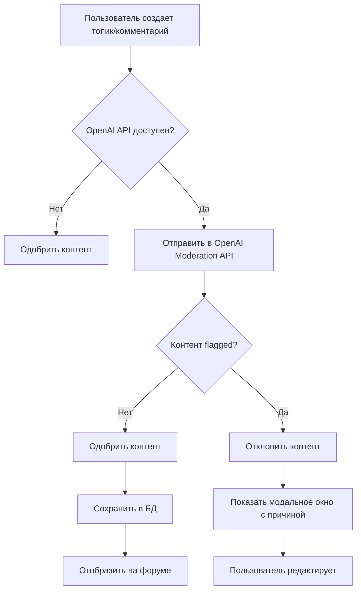

# AI-Модерация форума - Настройка и тестирование

**Дата:** 6 декабря 2025  
**Статус:** ✅ Реализовано (требует настройки OpenAI API key)

---

## Обзор

Реализована **блокирующая AI-модерация** контента форума через OpenAI Moderation API. Все новые топики и комментарии проверяются на соответствие правилам спільноти перед публикацией.

---

## Что реализовано

### Backend

1. **Модель `ModerationLog`** (`backend/app/models/moderation.py`)
   - Хранит результаты проверки контента
   - Поля: content_type, content_id, user_id, decision, reason, ai_response, content_text, created_at

2. **Сервис модерации** (`backend/app/services/moderation_service.py`)
   - `check_content_with_ai()` - проверка контента через OpenAI API
   - `check_forum_content()` - проверка контента форума (заголовок + текст)
   - Использует модель `omni-moderation-latest`
   - Определяет категории нарушений с уровнями уверенности

3. **Pydantic схемы** (`backend/app/schemas/moderation.py`)
   - `ModerationResultSchema` - результат проверки
   - `ModerationLogCreate` - создание лога
   - `ModerationError` - ошибка для фронтенда с рекомендациями

4. **API endpoints** (`backend/app/api/forum.py`)
   - `POST /api/forum/threads` - проверяет контент перед созданием топика
   - `POST /api/forum/posts` - проверяет контент перед созданием комментария
   - Возвращает 400 с деталями при отклонении

5. **Alembic миграция**
   - Создана таблица `moderation_logs`
   - Индексы на `decision`, `created_at`

### Frontend

1. **Компонент `ModerationErrorModal.tsx`**
   - Красивое модальное окно с причиной отклонения
   - Список рекомендаций на украинском языке
   - Информация об AI-системе
   - Responsive design (iOS + Web)

2. **Обработка ошибок модерации**
   - `app/forum/create-thread.tsx` - для создания топиков
   - `app/forum/create-thread.web.tsx` - web версия
   - `app/forum/thread/[id].tsx` - для создания комментариев
   - `app/forum/thread/[id].web.tsx` - web версия

---

## Настройка OpenAI API

### 1. Получить API ключ

1. Зайти на [platform.openai.com](https://platform.openai.com/)
2. Войти в аккаунт (или создать новый)
3. Перейти в "API keys" → "Create new secret key"
4. Скопировать ключ (он показывается только один раз!)

### 2. Добавить в `.env` (backend)

```bash
# backend/.env
OPENAI_API_KEY=sk-proj-...
```

### 3. Проверить настройки

```bash
# Проверка в config
cd backend
docker-compose exec backend python -c "from app.core.config import settings; print(f'OpenAI API Key: {settings.OPENAI_API_KEY[:10]}...')"
```

### 4. Перезапустить backend

```bash
cd backend
docker-compose restart backend
```

---

## Как работает модерация

### Процесс проверки

1. **Пользователь отправляет контент** (топик или комментарий)
2. **Backend → OpenAI Moderation API**
   - Отправляется текст для проверки
   - Используется модель `omni-moderation-latest`
3. **OpenAI возвращает результат**
   - `flagged: false` → контент **одобрен** ✅
   - `flagged: true` → контент **отклонен** ⛔
4. **Логирование в БД** (`moderation_logs`)
5. **Ответ пользователю**
   - Одобрено → контент публикуется
   - Отклонено → модальное окно с причиной и рекомендациями

### Категории нарушений

OpenAI проверяет контент на следующие категории:

| Категория | Описание на украинском |
|-----------|------------------------|
| `sexual` | Сексуальний контент |
| `hate` | Мова ненависті |
| `harassment` | Домагання |
| `self_harm` | Самопошкодження |
| `sexual_minors` | Сексуальний контент з неповнолітніми |
| `hate_threatening` | Погрози на фоні ненависті |
| `violence_graphic` | Графічне насильство |
| `violence` | Насильство |
| `illicit` | Незаконна діяльність |
| `illicit_violent` | Насильницька незаконна діяльність |

### Пороги уверенности

- **Высокая уверенность** (≥ 0.7) → показывается в причине
- **Средняя уверенность** (≥ 0.3) → показывается в причине
- Низкая уверенность (< 0.3) → игнорируется

---

## Тестирование

### 1. Тест с нормальным контентом

```bash
# Войти в аккаунт → Форум → Створити нову тему
Заголовок: "Як розрахувати ЄСВ для ФОП?"
Зміст: "Доброго дня! Підкажіть, будь ласка, як правильно розрахувати ЄСВ."

Ожидаемый результат: ✅ Топик создан успешно
```

### 2. Тест с нарушающим контентом

```bash
# Войти в аккаунт → Форум → Створити нову тему
Заголовок: "ДЕШЕВЫЕ КРЕДИТЫ БЕЗ ПРОВЕРОК!!!"
Зміст: "Деньги в долг всем! Переходи по ссылке!"

Ожидаемый результат: ⛔ Модальное окно с ошибкой
```

### 3. Тест с пустым контентом

```bash
# Войти в аккаунт → Форум → Створити нову тему
Заголовок: ""
Зміст: ""

Ожидаемый результат: ⛔ "Текст не може бути порожнім"
```

### 4. Проверка логов модерации

```sql
-- Посмотреть последние 10 проверок
SELECT 
    id, 
    content_type, 
    decision, 
    reason, 
    created_at 
FROM moderation_logs 
ORDER BY created_at DESC 
LIMIT 10;

-- Статистика по решениям
SELECT 
    decision, 
    COUNT(*) as count 
FROM moderation_logs 
GROUP BY decision;
```

### 5. Ручной тест сервиса

```python
# backend/app/services/moderation_service.py
cd backend
docker-compose exec backend python app/services/moderation_service.py
```

---

## Обработка ошибок

### Что происходит при ошибке OpenAI API?

```python
# moderation_service.py, lines 105-112
except Exception as e:
    logger.error(f"❌ Error during moderation: {e}")
    # В случае ошибки API - НЕ блокируем контент
    # (чтобы не нарушать работу форума при проблемах с OpenAI)
    return ModerationResult(
        approved=True,
        reason=f"Moderation API error (fallback to approve): {str(e)}"
    )
```

**Философия:** Если OpenAI API недоступен → контент **одобряется автоматически**.  
Это обеспечивает бесперебойную работу форума даже при проблемах с модерацией.

---

## Настройки модерации

### Отключение модерации (для тестирования)

Если нужно временно отключить модерацию:

```bash
# backend/.env
# Закомментировать или удалить OPENAI_API_KEY
# OPENAI_API_KEY=sk-proj-...
```

Сервис автоматически обнаружит отсутствие ключа и будет одобрять весь контент:

```python
# moderation_service.py, lines 49-51
if not settings.OPENAI_API_KEY:
    logger.warning("⚠️ OPENAI_API_KEY not configured, skipping moderation")
    return ModerationResult(approved=True, reason="Moderation disabled")
```

### Настройка порогов уверенности

Можно изменить пороги в `moderation_service.py`:

```python
# Lines 84-85
HIGH_THRESHOLD = 0.7  # Высокая уверенность
MEDIUM_THRESHOLD = 0.3  # Средняя уверенность
```

---

## Стоимость использования OpenAI

OpenAI Moderation API **бесплатный** для всех пользователей! 🎉

- Нет лимитов на количество запросов
- Не тарифицируется как GPT-3.5/GPT-4
- Подробнее: [platform.openai.com/docs/guides/moderation](https://platform.openai.com/docs/guides/moderation)

---

## Структура файлов

```
backend/
├── app/
│   ├── models/
│   │   └── moderation.py              # Модель ModerationLog
│   ├── schemas/
│   │   └── moderation.py              # Pydantic схемы
│   ├── services/
│   │   └── moderation_service.py      # Сервис проверки контента
│   └── api/
│       └── forum.py                   # Обновленные endpoints (async)
└── migrations/
    └── versions/
        └── 2025_12_06_*_add_moderation_logs_table.py

frontend/
├── components/
│   └── ModerationErrorModal.tsx       # Модальное окно ошибки
├── app/
│   └── forum/
│       ├── create-thread.tsx          # Создание топика (iOS)
│       ├── create-thread.web.tsx      # Создание топика (Web)
│       ├── thread/
│       │   ├── [id].tsx               # Комментарии (iOS)
│       │   └── [id].web.tsx           # Комментарии (Web)
```

---

## Troubleshooting

### Проблема: "OpenAI API error"

**Решение:**
1. Проверить наличие `OPENAI_API_KEY` в `.env`
2. Проверить правильность ключа (начинается с `sk-proj-`)
3. Проверить интернет-соединение в Docker
4. Перезапустить backend: `docker-compose restart backend`

### Проблема: Модальное окно не показывается

**Решение:**
1. Проверить логи frontend (console)
2. Проверить, что backend возвращает правильный формат ошибки:
   ```json
   {
     "detail": {
       "detail": "Ваш контент не пройшов автоматичну модерацію",
       "reason": "Контент порушує правила",
       "suggestions": [...]
     }
   }
   ```
3. Проверить импорт `ModerationErrorModal` в файлах

### Проблема: Контент публикуется даже с нарушениями

**Решение:**
1. Проверить логи backend: `docker-compose logs -f backend`
2. Проверить, что `OPENAI_API_KEY` настроен
3. Проверить базу данных:
   ```sql
   SELECT * FROM moderation_logs ORDER BY created_at DESC LIMIT 5;
   ```

---

## Дополнительная информация

### Документация OpenAI

- [Moderation API Guide](https://platform.openai.com/docs/guides/moderation)
- [API Reference](https://platform.openai.com/docs/api-reference/moderations)
- [Model Capabilities](https://platform.openai.com/docs/models/moderation)

### Алгоритм работы



---

## Статус

✅ **Этап 5 завершен!** Готово к тестированию после настройки OpenAI API key.

**Следующие этапы:**
- Этап 6: Раздел со статьями (только веб)
- Этап 7: Реквизиты налоговых органов (только веб)
- Этап 8: Генерация PDF платежек (только веб)

